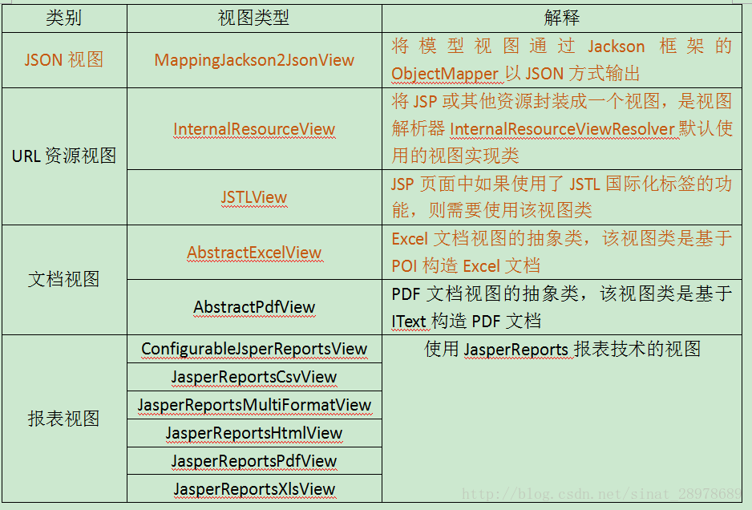
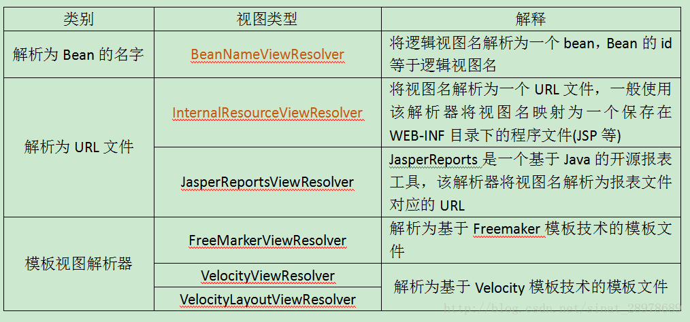

# 视图和视图解析器

请求处理方法执行完成后，最终返回一个ModelAndView对象，对于那些反回String，View或ModelMap等类型的处理方法，**SpringMVC也会在内部将它们装配成一个ModelAndView对象**，它包含了逻辑名和模型对象的视图

SpringMVC借助**视图解析器(ViewResolver)**得到最终的视图对象(View)，最终的视图可以是JSP，也可能是Excel、JFreeChart等种表现形式的视图

对于最终究竟采取何种视图对象模型数据进行渲染，处理器并不关心，处理器工作重点聚焦在生产模型数据的工作上，从而实现MVC的充分解耦

## 1､常用的视图实现类



## 2､视图解析器

SpringMVC为逻辑视图名的解析提供了不同的策略，可以在Spring WEB上下文中配置一种或多种解析策略，并指定他们之间的先后顺序，每一种映射策略对应一个具体的视图解析器实现类。

视图解析器的作用比较单一：将逻辑视图解析为一个具体的视图对象

所有的视图解析器都必须实现ViewResolver接口

**常用的视图解析器实现类**



程序员可以选择一种视图解析器或混用多种视图解析器

每个视图解析器都实现了Ordered接口并开放出一个order属生，**可以通过order属性指定解析器的优先顺序，order越小优先级越高**

SpringMVC会按视图解析器顺序的优先顺序对视图名进行解析，直到解析成功并返回视图对象，否则将抛出ServletException异常

**org.springframework.web.servlet.view.InternalResourceViewResolver**

JSP最常见的视图技术，可以使用InternalResourceViewResolver作为视图解析器

```xml
<bean class="org.springframework.web.servlet.view.InternalResourceViewResolver">
    <property name="prefix" value="/views/"/>
    <property name="suffix" value=".jsp"/>
</bean>
```

若项目中使用JSTL，则SpringMVC会自动把视图对象由InternalResourceViewResolver转为**JstlView**

```xml
<dependency>
    <groupId>javax.servlet</groupId>
    <artifactId>jstl</artifactId>
</dependency>
```

若使用JSTL的fmt标签则需要在SpringMVC的配置文件中**配置国际化资源文件**

i18n.properties

```properties
i18n.password=PassWord
i18n.username=UserName
```

i18n_zh_CN.properties

```properties
i18n.password=密码
i18n.username=用户名
```

i18n_en_US.properties

```properties
i18n.password=PassWord
i18n.username=UserName
```

```xml
<!-- 配置国际化资源文件 -->
<bean id="messageSource" class="org.springframework.context.support.ResourceBundleMessageSource">
    <!-- 国际化文件资源名 -->
    <property name="basename" value="i18n"/>
    <!-- 支持UTF-8的中文-->
    <property name="cacheSeconds" value="0"/>
    <property name="defaultEncoding" value="UTF-8"/>
</bean>
```

```jsp
<%@ page contentType="text/html;charset=UTF-8" language="java" %>
<%@ taglib prefix="fmt" uri="http://java.sun.com/jsp/jstl/fmt" %>
<html>
<head>
    <title>Title</title>
</head>
<body>
    <h1>Success Page</h1>

    国际化 <br>
    <fmt:message key="i18n.username"/>
    <fmt:message key="i18n.password"/>
</body>
</html>
```

若希望直接响应通过SpringMVC渲染的面页，可以使用mvc:view-controller标签实现

```xml
<!--
    配置直接转发的页面
    可以直接响应转发的页面，而无需再经过handler的方法
    访问：http://localhost:8080/success 跳转到success.jsp
-->
<mvc:view-controller path="/success" view-name="success"/>
<!-- 如配置了mvc:view-controller 在实际开发中通常都需要配置mvc:annotation-driven标签 -->
<mvc:annotation-driven/>
```

## 3､自定义视图

**Excel视图**

若希望使用Excel展示数据列表，仅需要扩展SpringMVC提供的AbstractExcelView或AbstractJExcelView即可。实现buildExcelDocument()方法，在方法中使用模型数据对象构建Excel文档就可以了

**AbstractExcelView基于POI API**，而AbstractJExcelView是基于JExcelAPI的

**视图对象需要配置IOC容器中的一个Bean使用BeanNameViewResolver作为视图解析器即可**

若希望直接在浏览器直接下载Excel文档，则可以设置响应头**Content-Disposition**的值为**attachment;filename=xxx.xls**

```java
@Component
public class HelloView implements View {

	@Override
	public String getContentType() {
		return "text/html";
	}

	@Override
	public void render(Map<String, ?> model, HttpServletRequest request, HttpServletResponse response) throws Exception {

		response.getWriter().println("hello view, time: " + new Date());
	}
}
```

```xml
<!-- 配置视图 BeanNameViewResolver 解析器：使用视图的名字来解析视图 -->
<bean class="org.springframework.web.servlet.view.BeanNameViewResolver">
    <!-- 通过order属性来定义视图解析器的优先级，order值越小优先级越高 -->
    <property name="order" value="100"/>
</bean>
```

```java
@Controller
@RequestMapping("/springmvc")
public class ViewResolverTest {
	
    /**
	 * http://localhost:8080/springmvc/testView
	 */
	@RequestMapping("/testView")
	public String testView(){
		System.out.println("testView");
        // Hello类@Component注解的名称为helloView
		return "helloView";
	}
}
```

## 4､关于重定向

一般情况下，控制器方法返回字符串类型的值会被当成逻辑视图名处理

如果返回的字符串中带"forward:"或"redirect:"前缀时，SpringMVC会对他们进行特殊处理，将 forward: 和 redirect: 当成指示符，其后的字符串作为URL来处理

​	redirect:success.jsp 会完成一个到success.jsp的重定向的操作

​	forward:success.jsp 会完成一个到success.jsp的转发操作

```java
/**
 * http://localhost:8080/springmvc/testRedirect
 *
 * 浏览器上显示的地址：http://localhost:8080/index.jsp
 */
@RequestMapping("/testRedirect")
public String testRedirect(){
	System.out.println("testRedirect");
	return "redirect:/index.jsp";
}

/**
 * http://localhost:8080/springmvc/testForward
 * 
 * 浏览器上显示的地址：http://localhost:8080/springmvc/testForward
 */
@RequestMapping("/testForward")
public String testForward(){
	System.out.println("testForward");
	return "forward:/index.jsp";
}
```

