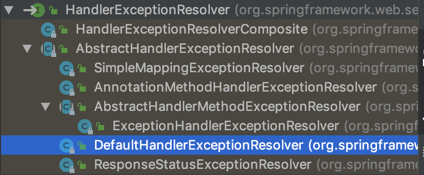

# 异常处理

SpringMVC通过HandlerExceptionResolver处理程序的异常，包括Handler映射，数据绑定以及目标方法执行时发生的异常

SpringMVC提供了HandlerExceptionResolver的实现类：



**HandlerExceptionResolver**

DispatcherServlet 默认装配的HandlerExceptionResolver

**没有使用<mvc:annotation-driven/>配置**

AnnotationMethodHandlerExceptionResolver

ResponseStatusExceptionResolver

DefaultHandlerExceptionResolver

**使用<mvc:annotation-driven/>配置**

ExceptionHandlerExceptionResolver

ResponseStatusExceptionResolver

DefaultHandlerExceptionResolver

## ExceptionHandlerExceptionResolver

主要处理Handler中用**@ExceptionHandler**注解定义的方法

@ExceptionHandler注解定义的方**法优先级问题**：例如发生的是NullPointerException，但是声明的异常有RuntimeException和Exception，此时会根据异常的最近继承关系找到继承深度最浅的那个

@ExceptionHandler注解方法，即标记了RuntimeException的方法

ExceptionHandlerExceptionResolver内部若找不到@ExceptionHandler注解的话，会找**@ControllerAdvice**中的**@ExceptionHandler**注解方法

```java
@Controller
public class SpringMVCTest {

	@RequestMapping("/testExceptionHandlerExceptionResolver")
	public String testExceptionHandlerExceptionResolver(@RequestParam("i") Integer i) {
		System.out.println("result: " + (10 / i));
		return "success";
	}

	/**
	 * 1、在@ExceptionHandler方法的入参中可以加入Exception类型的参数，该参数即对应发生的异常对象
	 * 2、@ExceptionHandler方法的入参中不能传入Map，若希望把异常信息传到页面上，需要使用ModelAndView作为返回值
	 * 3、@ExceptionHandler方法标记的异常有优先级的问题
	 * 4、@ControllerAdvice：如果在当前Handler中找不到@ExceptionHandler方法来处理当前方法的异常，则将去@ControllerAdvice标记的类中查找@ExceptionHandler标记的方法来处理异常
	 * @param ex
	 * @return
	 */
	@ExceptionHandler(value = {ArithmeticException.class})
	public ModelAndView handleArithmeticException(Exception ex) {
		System.out.println("[ArithmeticException] 出异常了: " + ex);
		ModelAndView modelAndView = new ModelAndView("error");
		modelAndView.addObject("exception", ex);
		return modelAndView;
	}

	@ExceptionHandler(value = {RuntimeException.class})
	public ModelAndView handleRuntimeException(Exception ex) {
		System.out.println("[RuntimeException] 出异常了: " + ex);
		ModelAndView modelAndView = new ModelAndView("error");
		modelAndView.addObject("exception", ex);
		return modelAndView;
	}
}
```

全局异常处理：

```java
@ControllerAdvice
public class MyExceptionHandler {

	@ExceptionHandler(value = {ArithmeticException.class})
	public ModelAndView handleArithmeticException(Exception ex) {
		System.out.println("[ArithmeticException] 出异常了: " + ex);
		ModelAndView modelAndView = new ModelAndView("error");
		modelAndView.addObject("exception", ex);
		return modelAndView;
	}
}
```

```xml
<mvc:annotation-driven/>
```

## ResponseStatusExceptionResolver

在异常及异常父类中找到**@ResponseStatus**注解，然后使用这个注解的属性进行处理

定义一个@ResponseStatus注解修饰的异常类

若在处理器方法中抛出了上述异常，若ExceptionHandlerExceptionResolver不解析上述异常。由于触发的异常UnauthorizedException带有@ResponseStatus注解。因此会被ResponseStatusExceptionResolver解析到。最后响应HttpStatus.UNAUTHORIZED代码给客户端。

HttpStatus.UNAUTHORIZED代表响应码401,无权限。关于其他的响应码请参与HttpStatus枚举类源码

```java
package zzc.springmvc.handlers;

import org.springframework.http.HttpStatus;
import org.springframework.web.bind.annotation.ResponseStatus;

@ResponseStatus(value = HttpStatus.FORBIDDEN,reason = "用户名和密码不匹配")
public class UserNameNotMatchPasswordException extends RuntimeException {

}
```

```java
//@ResponseStatus(value = HttpStatus.NOT_FOUND, reason = "测试")
@RequestMapping("/testResponseStatusExceptionResolver")
public String testResponseStatusExceptionResolver(@RequestParam("i") Integer i) {
    if (i.intValue() == 13) {
        throw new UserNameNotMatchPasswordException();
    }
    System.out.println("SpringMVCTest.testResponseStatusExceptionResolver");
    return "success";
}
```

## DefaultHandlerExceptionResolver

对一些特殊的异常进行处理，比如：

NoSuchRequestHandlingMethodException、HttpRequestMethodNotSupportedException、HttpMediaTypeNotAcceptableException、HttpMediaTypeNotSupportedException等

```java
@RequestMapping(value = "/testDefaultHandlerExceptionResolver", method = RequestMethod.POST)
public String testDefaultHandlerExceptionResolver() {
    System.out.println("SpringMVCTest.testDefaultHandlerExceptionResolver");
    return "success";
}
```


## SimpleMappingExceptionResolver

如果希望对所有异常进行统一处理，可以使用SimpleMappingExceptionResolver，它将异常类名映射为视图名，即发生异常时使用对应的视图报告异常

```java
/**
 * http://localhost:8080/testSimpleMappingExceptionResolver?i=11
 */
@RequestMapping("/testSimpleMappingExceptionResolver")
public String testSimpleMappingExceptionResolver(@RequestParam("i") Integer i){
    String[] vals = new String[10];
    System.out.println(vals[i]);
    return "success";
}
```

```xml
<!-- 配置使用SimpleMappingExceptionResolver来映射异常 -->
<bean class="org.springframework.web.servlet.handler.SimpleMappingExceptionResolver">
    <property name="exceptionAttribute" value="exception"/>
    <property name="exceptionMappings">
        <props>
            <!-- error：出错跳转页面 -->
            <prop key="java.lang.ArrayIndexOutOfBoundsException">error</prop>
        </props>
    </property>
</bean>
```

```jsp
<%@ page contentType="text/html;charset=UTF-8" language="java" %>
<html>
<head>
    <title>Title</title>
</head>
<body>
    <h1>Error Page</h1>
${requestScope.exception}
</body>
</html>
```

